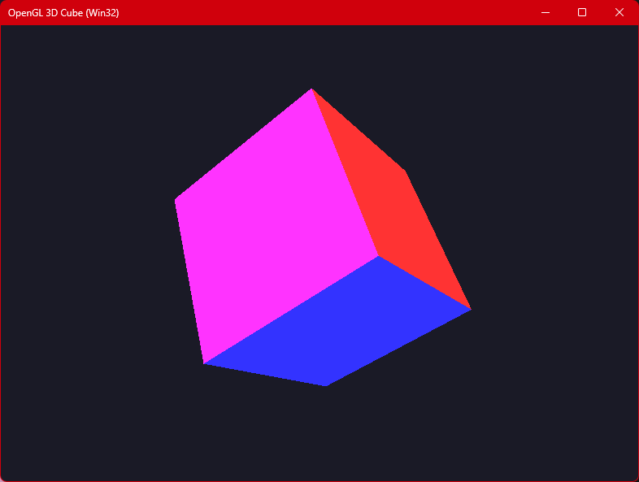

# Cube3Dgl

A simple and efficient 3D project in **C++** using the **Win32 API** and **OpenGL**, which renders a colored 3D cube with automatic fullscreen launch and quick toggling to windowed mode.

Built purely with native Windows APIs (WGL) without relying on third-party frameworks or libraries (such as GLUT, GLFW, or GLEW).



---

## 🚀 Features

* **Pure Win32 + OpenGL:** Requires no external dependencies or third-party window managers.
* **Borderless Fullscreen:** Automatically launches in borderless fullscreen mode on startup.
* **Dynamic Toggling:** Seamlessly switch between fullscreen and windowed modes on the fly.
* **Z-Buffer & Double Buffering:** Utilizes a 24-bit depth buffer for correct face overlap and double buffering for flicker-free rendering.
* **Optimized Render Loop:** Uses a non-blocking `PeekMessage` event loop for a stable frame rate.

---

## 🎮 Controls

| Key | Action |
| :--- | :--- |
| `Enter` / `Space` | Toggle between fullscreen and windowed mode |
| `Esc` | Exit application |

---

## 🛠 Prerequisites & Building

### Requirements
* Operating System: **Windows 10 / 11**
* IDE: **Visual Studio 2019 / 2022** (or any compatible C++ compiler on Windows)
* Graphics Libraries: Native `opengl32.lib` and `glu32.lib` (included by default in the Windows SDK)

### Build Steps in Visual Studio

1. Clone the repository:
   ```bash
   git clone [https://github.com/An0ther0ne/Cube3Dgl.git](https://github.com/An0ther0ne/Cube3Dgl.git)